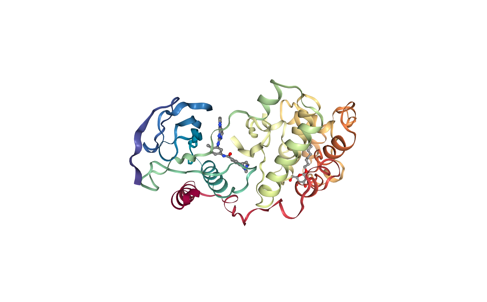

# Protein-ligand Docking tutorial using BioExcel Building Blocks (biobb)
**-- *Fpocket Version* --**

***
This tutorial aims to illustrate the process of **protein-ligand docking**, step by step, using the **BioExcel Building Blocks library (biobb)**. The particular example used is the **Mitogen-activated protein kinase 14** (p38-α) protein (PDB code [3HEC](https://www.rcsb.org/structure/3HEC)), a well-known **Protein Kinase enzyme**, 
 in complex with the FDA-approved **Imatinib**, (PDB Ligand code [STI](https://www.rcsb.org/ligand/STI), DrugBank Ligand Code [DB00619](https://go.drugbank.com/drugs/DB00619)), a small molecule **kinase inhibitor** used to treat certain types of **cancer**. 
 
The tutorial will guide you through the process of identifying the **active site cavity** (pocket) without previous knowledge, and the final prediction of the **protein-ligand complex**. 

Please note that **docking algorithms**, and in particular, **AutoDock Vina** program used in this tutorial, are **non-deterministic**. That means that results obtained when running the workflow **could be diferent** from the ones we obtained during the writing of this tutorial (see [AutoDock Vina manual](http://vina.scripps.edu/manual.html)). We invite you to try the docking process several times to verify this behaviour. 
***


<div style="background:#b5e0dd; padding: 15px;"><strong>Important:</strong> it is recommended to execute this tutorial step by step (not as a single workflow execution, <strong><em>Run All</em></strong> mode), as it has interactive selections.</div>

## Settings

### Biobb modules used

 - [biobb_io](https://github.com/bioexcel/biobb_io): Tools to fetch biomolecular data from public databases.
 - [biobb_structure_utils](https://github.com/bioexcel/biobb_structure_utils): Tools to modify or extract information from a PDB structure file.
 - [biobb_chemistry](https://github.com/bioexcel/biobb_chemistry): Tools to perform chemoinformatics processes.
 - [biobb_vs](https://github.com/bioexcel/biobb_vs): Tools to perform virtual screening studies.

### Auxiliar libraries used

* [jupyter](https://jupyter.org/): Free software, open standards, and web services for interactive computing across all programming languages.
* [nglview](http://nglviewer.org/#nglview): Jupyter/IPython widget to interactively view molecular structures and trajectories in notebooks.

### Conda Installation

```console
git clone https://github.com/bioexcel/biobb_wf_virtual-screening.git
cd biobb_wf_virtual-screening
conda env create -f conda_env/environment.yml
conda activate biobb_VS_tutorial
jupyter-notebook biobb_wf_virtual-screening/notebooks/fpocket/wf_vs_fpocket.ipynb
```

***
## Pipeline steps
 1. [Input Parameters](#input)
 2. [Fetching PDB Structure](#fetch)
 3. [Extract Protein Structure](#extractProtein)
 4. [Computing Protein Cavities (fpocket)](#fpocket)
 5. [Filtering Protein Cavities (fpocket output)](#fpocketFilter)
 6. [Extract Pocket Cavity ](#fpocketSelect)
 7. [Generating Cavity Box ](#cavityBox)
 8. [Downloading Small Molecule](#downloadSmallMolecule)
 9. [Converting Small Molecule](#sdf2pdb)
 10. [Preparing Small Molecule (ligand) for Docking](#ligand_pdb2pdbqt)
 11. [Preparing Target Protein for Docking](#protein_pdb2pdbqt)
 12. [Running the Docking](#docking)
 13. [Extract a Docking Pose](#extractPose)
 14. [Converting Ligand Pose to PDB format](#pdbqt2pdb)
 15. [Superposing Ligand Pose to the Target Protein Structure](#catPdb)
 16. [Comparing final result with experimental structure](#viewFinal)
 17. [Questions & Comments](#questions)
 
***

***


<a id="input"></a>
## Input parameters
**Input parameters** needed:

 - **pdb_code**: PDB code of the experimental complex structure (if exists).<br>
In this particular example, the **p38α** structure in complex with the **Imatinib drug** was experimentally solved and deposited in the **PDB database** under the **3HEC** PDB code. The protein structure from this PDB file will be used as a **target protein** for the **docking process**, after stripping the **small molecule**. An **APO structure**, or any other structure from the **p38α** [cluster 100](https://www.rcsb.org/search?request=%7B%22query%22%3A%7B%22type%22%3A%22terminal%22%2C%22service%22%3A%22sequence%22%2C%22parameters%22%3A%7B%22target%22%3A%22pdb_protein_sequence%22%2C%22value%22%3A%22RPTFYRQELNKTIWEVPERYQNLSPVGSGAYGSVCAAFDTKTGLRVAVKKLSRPFQSIIHAKRTYRELRLLKHMKHENVIGLLDVFTPARSLEEFNDVYLVTHLMGADLNNIVKCQKLTDDHVQFLIYQILRGLKYIHSADIIHRDLKPSNLAVNEDCELKILDFGLARHTDDEMTGYVATRWYRAPEIMLNWMHYNQTVDIWSVGCIMAELLTGRTLFPGTDHIDQLKLILRLVGTPGAELLKKISSESARNYIQSLTQMPKMNFANVFIGANPLAVDLLEKMLVLDSDKRITAAQALAHAYFAQYHDPDDEPVADPYDQSFESRDLLIDEWKSLTYDEVISFVPPP%22%2C%22identity_cutoff%22%3A1%2C%22evalue_cutoff%22%3A0.1%7D%2C%22node_id%22%3A0%7D%2C%22return_type%22%3A%22polymer_entity%22%2C%22request_options%22%3A%7B%22pager%22%3A%7B%22start%22%3A0%2C%22rows%22%3A25%7D%2C%22scoring_strategy%22%3A%22combined%22%2C%22sort%22%3A%5B%7B%22sort_by%22%3A%22score%22%2C%22direction%22%3A%22desc%22%7D%5D%7D%2C%22request_info%22%3A%7B%22src%22%3A%22ui%22%2C%22query_id%22%3A%22bea5861f8b38a9e25a3e626b39d6bcbf%22%7D%7D) (sharing a 100% of sequence similarity with the **p38α** structure) could also be used as a **target protein**. This structure of the **protein-ligand complex** will be also used in the last step of the tutorial to check **how close** the resulting **docking pose** is from the known **experimental structure**. 
 -----
 - **ligandCode**: Ligand PDB code (3-letter code) for the small molecule (e.g. STI).<br>
In this particular example, the small molecule chosen for the tutorial is the FDA-approved drug **Imatinib** (PDB Code STI), a type of cancer growth blocker, used in [diferent types of leukemia](https://go.drugbank.com/drugs/DB00619).
 -----
 - **pockets_dir**: Name of a folder to write temporary files.


```python
import nglview
import ipywidgets

pdb_code = "3HEC"         # P38 + Imatinib

ligand_code = "STI"       # Imatinib

pockets_dir = "pockets"
```

<a id="fetch"></a>
***
## Fetching PDB structure
Downloading **PDB structure** with the **protein molecule** from the PDBe database.<br>
Alternatively, a **PDB file** can be used as starting structure. <br>
***
**Building Blocks** used:
 - [Pdb](https://biobb-io.readthedocs.io/en/latest/api.html#module-api.pdb) from **biobb_io.api.pdb**
***


```python
from biobb_io.api.pdb import pdb

download_pdb = "download.pdb"
prop = {
  "pdb_code": pdb_code,
  "filter": ["ATOM", "HETATM"]
}

pdb(output_pdb_path=download_pdb,
    properties=prop)
```

<a id="vis3D"></a>
### Visualizing 3D structure
Visualizing the downloaded/given **PDB structure** using **NGL**.<br><br>
Note (and try to identify) the **Imatinib small molecule (STI)** and the **detergent (β-octyl glucoside) (BOG)** used in the experimental reservoir solution to obtain the crystal.


```python
view = nglview.show_structure_file(download_pdb, default=True)
view.center()
view._remote_call('setSize', target='Widget', args=['','600px'])

view
```

</img>

<a id="extractProtein"></a>
***
## Extract Protein Structure
Extract **protein structure** from the **downloaded PDB file**. Removing **any extra molecule** (ligands, ions, water molecules). <br><br>
The **protein structure** will be used as a **target** in the **protein-ligand docking process**. 
***
**Building Blocks** used:
 - [extract_molecule](https://biobb-structure-utils.readthedocs.io/en/latest/utils.html#module-utils.extract_molecule) from **biobb_structure_utils.utils.extract_molecule**
***


```python
from biobb_structure_utils.utils.extract_molecule import extract_molecule

pdb_protein = "pdb_protein.pdb"

extract_molecule(input_structure_path=download_pdb,
             output_molecule_path = pdb_protein)
```

<a id="vis3D"></a>
### Visualizing 3D structure
Visualizing the downloaded/given **PDB structure** using **NGL**.<br><br>
Note that the **small molecules** included in the original structure are now gone. The new structure only contains the **protein molecule**, which will be used as a **target** for the **protein-ligand docking**. 


```python
view = nglview.show_structure_file(pdb_protein, default=False)
view.add_representation(repr_type='cartoon', 
                        selection='not het',
                       colorScheme = 'atomindex')
view.center()
view._remote_call('setSize', target='Widget', args=['','600px'])

view
```

</img>

<a id="fpocket"></a>
***
## Computing Protein Cavities (fpocket)
Computing the **protein cavities** (pockets) using the well-known [**fpocket**](https://bmcbioinformatics.biomedcentral.com/articles/10.1186/1471-2105-10-168) tool.<br>
These **cavities** will be then used in the **docking procedure** to try to find the **best region of the protein surface** where the small molecule can **bind**. <br><br>
Although in this particular example we already know the **binding site** region, as we started from a **protein-ligand complex** structure where the ligand was located in the same **binding site** as **Imatinib** is binding, this is not always the case. In the cases where we do not know these regions, **fpocket** will help us identifying the possible **binding sites** of our **target protein**.<br>

**fpocket** input parameters, such as **minimum** and **maximum radius** (in Angstroms) the alpha spheres might have in a **binding pocket** can be adjusted (min_radius, max_radius) . Parameters used in this particular example are 3Å for the **minimum radius** and 6Å for the **maximum radius**. The **minimum number of alpha spheres** a pocket must contain in order to figure in the results is also adjusted to 35. See the [fpocket manual](http://fpocket.sourceforge.net/manual_fpocket2.pdf) for more information.<br> 
<br>
***
**Building Blocks** used:
 - [fpocket](https://biobb-vs.readthedocs.io/en/latest/fpocket.html#module-fpocket.fpocket_run) from **biobb_vs.fpocket.fpocket_run**
***


```python
from biobb_vs.fpocket.fpocket_run import fpocket_run

fpocket_all_pockets = "fpocket_all_pockets.zip"
fpocket_summary = "fpocket_summary.json"
prop = {
    "min_radius": 3,
    "max_radius": 6,
    "num_spheres": 35
}

fpocket_run(input_pdb_path=pdb_protein,
            output_pockets_zip = fpocket_all_pockets,
            output_summary=fpocket_summary,
            properties=prop)
```

<a id="checkJson"></a>
### Checking fpocket output (json)
Checking the **fpocket** output from the **json file**. Every **pocket** has a separated entry in the json output, with information such as: **score, druggability score, volume, hydrophobicity, polarity or flexibility**. 


```python
import json

with open(fpocket_summary, 'r') as json_file:
    data = json.load(json_file)
    print(json.dumps(data, indent=4))
```

<a id="fpocketFilter"></a>
***
## Filtering Protein Cavities (fpocket output)
Filtering the **protein cavities** (pockets) identified by **fpocket**.<br>
In this particular example, the biggest **cavities**, with a **volume** between 800 and 2000 ($Å^{3}$), big enough volume to fit the input small molecule, are selected. <br>

***
**Building Blocks** used:
 - [fpocket_filter](https://biobb-vs.readthedocs.io/en/latest/fpocket.html#module-fpocket.fpocket_filter) from **biobb_vs.fpocket.fpocket_filter**
***


```python
from biobb_vs.fpocket.fpocket_filter import fpocket_filter

fpocket_filter_pockets = "fpocket_filter_pockets.zip"
prop = {
    "volume": [800, 2000]
}

fpocket_filter(input_pockets_zip=fpocket_all_pockets,
                input_summary = fpocket_summary,
                output_filter_pockets_zip=fpocket_filter_pockets,
                properties=prop)
```

<a id="extractPockets"></a>
### Extract selected pockets (cavities)
Extract the selected **pockets** (cavities) from the filtered list (zip file, fpocket_filter_pockets).<br>
Writing the information in the ***pockets_dir*** folder.<br>
Also saving the list of **PDB files** (protein residues forming the pocket) and **PQR files** (cavity, pocket), to be used in following **visualization step**. 


```python
import os
import shutil

from pathlib import Path, PurePath
import zipfile

if Path(pockets_dir).exists(): shutil.rmtree(pockets_dir) 
os.mkdir(pockets_dir)

with zipfile.ZipFile(fpocket_filter_pockets, 'r') as zip_ref:
    zip_ref.extractall(pockets_dir)

path_pockets = [str(i) for i in Path(pockets_dir).iterdir()]
path_pockets_pdb = [str(i) for i in Path(pockets_dir).iterdir() if PurePath(i).suffix == '.pdb']
path_pockets_pqr = [str(i) for i in Path(pockets_dir).iterdir() if PurePath(i).suffix == '.pqr']
```

<a id="viewPockets"></a>
### Visualizing selected pockets (cavities)
Visualizing the selected **pockets** (cavities) from the filtered list using **NGL viewer**.<br>

**Protein residues** forming the **cavity** are represented in **random-colored surfaces**. **Pockets** are represented in a **blue-colored mesh**. Different **pockets** are identified with a floating **label**.


```python
import re
import random

# random colors for cavities
r = lambda: random.randint(0,255)

# load structure
view = nglview.NGLWidget()
c = view.add_component(pdb_protein)

# load cavities (d) and pockets (p) and create pocketNames list
c = {}
p = {}
pocketNames = []
for pock in path_pockets:
    g = re.findall('(?:pocket)(\d+)(?:_\w+)\.(\w+)', pock)
    i = g[0][0]
    suff = g[0][1]
    if not [item for item in pocketNames if ('pocket' + i) in item]: pocketNames.append(('pocket' + i, int(i)))

    if suff == 'pdb':
        c[i] = view.add_component(pock)
        c[i].clear()
    else:
        p[i] = view.add_component(pock)
        p[i].clear()

# sort pocket names
pocketNames.sort(key=lambda tup: tup[1])
        
# representation for cavities
for pock in path_pockets_pdb:
    g = re.findall('(?:pocket)(\d+)(?:_\w+)\.(\w+)', pock)
    i = g[0][0]
    c[i].add_surface(color='#{}'.format((r(),r(),r())), 
                     radius='1.5',
                     lowResolution= True,
                     # 0: low resolution 
                     smooth=1,
                     useWorker= True,
                     wrap= True)
    
# representation for pockets
for pock in path_pockets_pqr:
    g = re.findall('(?:pocket)(\d+)(?:_\w+)\.(\w+)', pock)
    i = g[0][0]
    p[i].add_surface( component=i, color='skyblue', surfaceType= 'av', contour=True )

view.center()
view._remote_call('setSize', target='Widget', args=['','600px'])
view

# show pocket labels
code = """
var stage = this.stage;
var view = this.stage.viewer;
var clist_len = stage.compList.length;
var i = 0;
for(i = 0; i <= clist_len; i++){
    if(stage.compList[i] != undefined && stage.compList[i].structure != undefined && stage.compList[i].object.name.indexOf('pqr') != -1) {        

        var elm = document.createElement("div");
        elm.innerText = 'pocket' + stage.compList[i].object.name.match(/\d+/g)
        elm.style.color = "black";
        elm.style.background = "rgba(201, 149, 6, .8)";
        elm.style.padding = "8px";
        
        stage.compList[i].addAnnotation(stage.compList[i].structure.center, elm)
    }
}
"""

view._execute_js_code(code)

view
```

</img>

<a id="selectPockets"></a>
### Select pocket (cavity)
Select a specific **pocket** (cavity) from the filtered list to be used in the **docking procedure**. <br>

If **fpocket** has been able to identify the correct **binding site**, which we know from the original **protein-ligand structure**, it just needs to be selected. In this particular example, the pocket we are interested in is the **pocket number 6**. <br>

Choose a **pocket** from the **DropDown list**:


```python
mdsel = ipywidgets.Dropdown(
    options=pocketNames,
    description='Sel. pocket:',
    disabled=False,
)
display(mdsel)
```

<a id="fpocketSelect"></a>
***
## Extract Pocket Cavity 
Extract the selected **protein cavity** (pocket) from the **fpocket** results.<br>

It will be used to generate the **docking box** in the **following step**.

***
**Building Blocks** used:
 - [fpocket_select](https://biobb-vs.readthedocs.io/en/latest/fpocket.html#module-fpocket.fpocket_select) from **biobb_vs.fpocket.fpocket_select**
***


```python
from biobb_vs.fpocket.fpocket_select import fpocket_select

fpocket_cavity = "fpocket_cavity.pdb"
fpocket_pocket = "fpocket_pocket.pqr"
prop = {
    "pocket": mdsel.value
}

fpocket_select(input_pockets_zip=fpocket_filter_pockets,
                output_pocket_pdb = fpocket_cavity,
                output_pocket_pqr=fpocket_pocket,
                properties=prop)
```

<a id="cavityBox"></a>
***
## Generating Cavity Box 
Generating a **box** surrounding the selected **protein cavity** (pocket), to be used in the **docking procedure**. The **box** is defining the region on the **surface** of the **protein target** where the **docking program** should explore a possible **ligand dock**.<br>
An offset of **12 Angstroms** is used to generate a **big enough box** to fit the **small molecule** and its possible rotations.<br>

***
**Building Blocks** used:
 - [box](https://biobb-vs.readthedocs.io/en/latest/utils.html#module-utils.box) from **biobb_vs.utils.box**
***


```python
from biobb_vs.utils.box import box

output_box = "box.pdb"
prop = {
    "offset": 12,
    "box_coordinates": True
}

box(input_pdb_path = fpocket_pocket,
            output_pdb_path = output_box,
            properties=prop)
```

<a id="vis3D"></a>
### Visualizing binding site box in 3D structure
Visualizing the **protein structure**, the **selected cavity**, and the **generated box**, all together using **NGL** viewer. Using the **original structure** with the **small ligand** inside (Imatinib, [STI](https://www.rcsb.org/ligand/STI)), to check that the **selected cavity** is placed in the **same region** as the **original ligand**. 


```python
view = nglview.NGLWidget()
s = view.add_component(download_pdb)
b = view.add_component(output_box)
p = view.add_component(fpocket_pocket)
p.clear()

atomPair = [
    [ "9999:Z.ZN1", "9999:Z.ZN2" ],
    [ "9999:Z.ZN2", "9999:Z.ZN4" ],
    [ "9999:Z.ZN4", "9999:Z.ZN3" ],
    [ "9999:Z.ZN3", "9999:Z.ZN1" ],
    
    [ "9999:Z.ZN5", "9999:Z.ZN6" ],
    [ "9999:Z.ZN6", "9999:Z.ZN8" ],
    [ "9999:Z.ZN8", "9999:Z.ZN7" ],
    [ "9999:Z.ZN7", "9999:Z.ZN5" ],
    
    [ "9999:Z.ZN1", "9999:Z.ZN5" ],
    [ "9999:Z.ZN2", "9999:Z.ZN6" ],
    [ "9999:Z.ZN3", "9999:Z.ZN7" ],
    [ "9999:Z.ZN4", "9999:Z.ZN8" ]
]

# structure
s.add_representation(repr_type='cartoon', 
                        selection='not het',
                        color='#cccccc',
                       opacity=.2)
# ligands box
b.add_representation(repr_type='ball+stick',
                     selection='9999',
                     color='pink', 
                     aspectRatio = 8)
# lines box
b.add_representation(repr_type='distance', 
                     atomPair= atomPair,
                     labelVisible=False,
                     color= 'black')

# pocket
p.add_surface(component=mdsel.value, 
              color='skyblue', 
              surfaceType= 'av', 
              lowResolution= True,
              # 0: low resolution 
              smooth=1,
              contour=True,
              opacity=0.4,
              useWorker= True,
              wrap= True )


view.center()
view._remote_call('setSize', target='Widget', args=['','600px'])

view
```

</img>

<a id="downloadSmallMolecule"></a>
***
## Downloading Small Molecule 
Downloading the desired **small molecule** to be used in the **docking procedure**. <br>
In this particular example, the small molecule of interest is the FDA-approved drug **Imatinib**, with PDB code **STI**.<br>

***
**Building Blocks** used:
 - [ideal_sdf](https://biobb-io.readthedocs.io/en/latest/api.html#module-api.ideal_sdf) from **biobb_io.api.ideal_sdf**
***


```python
from biobb_io.api.ideal_sdf import ideal_sdf

sdf_ideal = "ideal.sdf"
prop = {
  "ligand_code": ligand_code
}

ideal_sdf(output_sdf_path=sdf_ideal,
    properties=prop)

```

<a id="sdf2pdb"></a>
***
## Converting Small Molecule 
Converting the desired **small molecule** to be used in the **docking procedure**, from **SDF** format to **PDB** format using the **OpenBabel chemoinformatics** tool. <br>

***
**Building Blocks** used:
 - [babel_convert](https://biobb-chemistry.readthedocs.io/en/latest/babelm.html#module-babelm.babel_convert) from **biobb_chemistry.babelm.babel_convert**
***


```python
from biobb_chemistry.babelm.babel_convert import babel_convert

ligand = "ligand.pdb"
prop = {
    "input_format": "sdf",
    "output_format": "pdb",
    "binary_path": "obabel"
}

babel_convert(input_path = sdf_ideal,
            output_path = ligand,
            properties=prop)
```

<a id="ligand_pdb2pdbqt"></a>
***
## Preparing Small Molecule (ligand) for Docking
Preparing the **small molecule** structure for the **docking procedure**. Converting the **PDB file** to a **PDBQT file** format (AutoDock PDBQT: Protein Data Bank, with Partial Charges (Q), & Atom Types (T)), needed by **AutoDock Vina**. <br><br>
The process adds **partial charges** and **atom types** to every atom. Besides, the **ligand flexibility** is also defined in the information contained in the file. The concept of **"torsion tree"** is used to represent the **rigid and rotatable** pieces of the **ligand**. A rigid piece (**"root"**) is defined, with zero or more rotatable pieces (**"branches"**), hanging from the root, and defining the **rotatable bonds**.<br><br>
More info about **PDBQT file format** can be found in the [AutoDock FAQ pages](http://autodock.scripps.edu/faqs-help/faq/what-is-the-format-of-a-pdbqt-file).

***
**Building Blocks** used:
 - [babel_convert](https://biobb-chemistry.readthedocs.io/en/latest/babelm.html#module-babelm.babel_convert) from **biobb_chemistry.babelm.babel_convert**
***


```python
from biobb_chemistry.babelm.babel_convert import babel_convert

prep_ligand = "prep_ligand.pdbqt"
prop = {
    "input_format": "pdb",
    "output_format": "pdbqt",
    "binary_path": "obabel"
}

babel_convert(input_path = ligand,
            output_path = prep_ligand,
            properties=prop)
```

<a id="viewDrug"></a>
### Visualizing small molecule (drug)
Visualizing the desired **drug** to be docked to the **target protein**, using **NGL viewer**.<br>
- **Left panel**: **PDB-formatted** file, with all hydrogen atoms.
- **Right panel**: **PDBqt-formatted** file (AutoDock Vina-compatible), with **united atom model** (only polar hydrogens are placed in the structures to correctly type heavy atoms as hydrogen bond donors).


```python
from ipywidgets import HBox

v0 = nglview.show_structure_file(ligand)
v1 = nglview.show_structure_file(prep_ligand)

v0._set_size('500px', '')
v1._set_size('500px', '')

def on_change(change):
    v1._set_camera_orientation(change['new'])
    
v0.observe(on_change, ['_camera_orientation'])

HBox([v0, v1])
```

</img>

<a id="protein_pdb2pdbqt"></a>
***
## Preparing Target Protein for Docking
Preparing the **target protein** structure for the **docking procedure**. Converting the **PDB file** to a **PDBqt file**, needed by **AutoDock Vina**. Similarly to the previous step, the process adds **partial charges** and **atom types** to every target protein atom. In this case, however, we are not taking into account **receptor flexibility**, although **Autodock Vina** allows some limited flexibility of selected **receptor side chains** [(see the documentation)](https://autodock-vina.readthedocs.io/en/latest/docking_flexible.html).<br>

***
**Building Blocks** used:
 - [str_check_add_hydrogens](https://biobb-structure-utils.readthedocs.io/en/latest/utils.html#utils-str-check-add-hydrogens-module) from **biobb_structure_utils.utils.str_check_add_hydrogens**
***


```python
from biobb_structure_utils.utils.str_check_add_hydrogens import str_check_add_hydrogens

prep_receptor = "prep_receptor.pdbqt"
prop = {
    "charges": True,
    "mode": "auto"
}

str_check_add_hydrogens(input_structure_path = pdb_protein,
            output_structure_path = prep_receptor,
            properties=prop)
```

<a id="docking"></a>
***
## Running the Docking
Running the **docking process** with the prepared files:
- **ligand**
- **target protein**
- **binding site box**<br>

using **AutoDock Vina**. <br><br>

***
**Building Blocks** used:
 - [autodock_vina_run](https://biobb-vs.readthedocs.io/en/latest/vina.html#module-vina.autodock_vina_run) from **biobb_vs.vina.autodock_vina_run**
***


```python
from biobb_vs.vina.autodock_vina_run import autodock_vina_run

output_vina_pdbqt = "output_vina.pdbqt"
output_vina_log = "output_vina.log"
prop = { }

autodock_vina_run(input_ligand_pdbqt_path = prep_ligand,
             input_receptor_pdbqt_path = prep_receptor,
             input_box_path = output_box,
             output_pdbqt_path = output_vina_pdbqt,
             output_log_path = output_vina_log,
             properties = prop)
```

<a id="viewDocking"></a>
### Visualizing docking output poses
Visualizing the generated **docking poses** for the **ligand**, using **NGL viewer**. <br>
- **Left panel**: **Docking poses** displayed with atoms coloured by **partial charges** and **licorice** representation.
- **Right panel**: **Docking poses** displayed with atoms coloured by **element** and **ball-and-stick** representation.


```python
from ipywidgets import HBox

models = 'all'

v0 = nglview.show_structure_file(output_vina_pdbqt, default=False)
v0.add_representation(repr_type='licorice', 
                        selection=models,
                       colorScheme= 'partialCharge')
v0.center()
v1 = nglview.show_structure_file(output_vina_pdbqt, default=False)
v1.add_representation(repr_type='ball+stick', 
                        selection=models)
v1.center()

v0._set_size('500px', '')
v1._set_size('500px', '')

def on_change(change):
    v1._set_camera_orientation(change['new'])
    
v0.observe(on_change, ['_camera_orientation'])

HBox([v0, v1])
```

</img>

<a id="selectPose"></a>
### Select Docking Pose
Select a specific **docking pose** from the output list for **visual inspection**.
<br>
Choose a **docking pose** from the **DropDown list**.


```python
from Bio.PDB import PDBParser
parser = PDBParser(QUIET = True)
structure = parser.get_structure("protein", output_vina_pdbqt)
models = []
for i, m in enumerate(structure):
    models.append(('model' + str(i), i))
    
mdsel = ipywidgets.Dropdown(
    options=models,
    description='Sel. model:',
    disabled=False,
)
display(mdsel)
```

<a id="extractPose"></a>
***
## Extract a Docking Pose
Extract a specific **docking pose** from the **docking** outputs. <br>

***
**Building Blocks** used:
 - [extract_model_pdbqt](https://biobb-vs.readthedocs.io/en/latest/utils.html#module-utils.extract_model_pdbqt) from **biobb_vs.utils.extract_model_pdbqt**
***


```python
from biobb_vs.utils.extract_model_pdbqt import extract_model_pdbqt

output_pdbqt_model = "output_model.pdbqt"
prop = {
    "model": mdsel.value + 1
}

extract_model_pdbqt(input_pdbqt_path = output_vina_pdbqt,
             output_pdbqt_path = output_pdbqt_model,
            properties=prop)
```

<a id="pdbqt2pdb"></a>
***
## Converting Ligand Pose to PDB format
Converting **ligand pose** to **PDB format**. <br>

***
**Building Blocks** used:
 - [babel_convert](https://biobb-chemistry.readthedocs.io/en/latest/babelm.html#module-babelm.babel_convert) from **biobb_chemistry.babelm.babel_convert**
***


```python
from biobb_chemistry.babelm.babel_convert import babel_convert

output_pdb_model = "output_model.pdb"
prop = {
    "input_format": "pdbqt",
    "output_format": "pdb",
    "binary_path": "obabel"
}

babel_convert(input_path = output_pdbqt_model,
             output_path = output_pdb_model,
            properties=prop)
```

<a id="catPdb"></a>
***
## Superposing Ligand Pose to the Target Protein Structure
Superposing **ligand pose** to the target **protein structure**, in order to see the **protein-ligand docking conformation**. <br><br>Building a new **PDB file** with both **target and ligand** (binding pose) structures. <br>

***
**Building Blocks** used:
 - [cat_pdb](https://biobb-structure-utils.readthedocs.io/en/latest/utils.html#module-utils.cat_pdb) from **biobb_structure_utils.utils.cat_pdb**
***


```python
from biobb_structure_utils.utils.cat_pdb import cat_pdb

output_structure = "output_structure.pdb"

cat_pdb(input_structure1 = pdb_protein,
             input_structure2 = output_pdb_model,
             output_structure_path = output_structure)
```

<a id="viewFinal"></a>
### Comparing final result with experimental structure 
Visualizing and comparing the generated **protein-ligand** complex with the original **protein-ligand conformation** (downloaded from the PDB database), using **NGL viewer**. <br>
- **Licorice, element-colored** representation: **Experimental pose**.
- **Licorice, green-colored** representation: **Docking pose**.
<br>

Note that outputs from **AutoDock Vina** don't contain all the atoms, as the program works with a **united-atom representation** (i.e. only polar hydrogens).


```python
view = nglview.NGLWidget()

# v1 = Experimental Structure
v1 = view.add_component(download_pdb)

v1.clear()
v1.add_representation(repr_type='licorice', 
                     selection='STI',
                     radius=0.5)

# v2 = Docking result
v2 = view.add_component(output_structure)
v2.clear()
v2.add_representation(repr_type='cartoon', colorScheme = 'sstruc')
v2.add_representation(repr_type='licorice', radius=0.5, color= 'green', selection='UNL')

view._remote_call('setSize', target='Widget', args=['','600px'])
view

# align reference and output
code = """
var stage = this.stage;
var clist_len = stage.compList.length;
var i = 0;
var s = [];
for(i = 0; i <= clist_len; i++){
    if(stage.compList[i] != undefined && stage.compList[i].structure != undefined) {        
       s.push(stage.compList[i])
    }
}
NGL.superpose(s[0].structure, s[1].structure, true, ".CA")
s[ 0 ].updateRepresentations({ position: true })
s[ 0 ].autoView()
"""

view._execute_js_code(code)

view
```

</img>

***
<a id="questions"></a>

## Questions & Comments

Questions, issues, suggestions and comments are really welcome!

* GitHub issues:
    * [https://github.com/bioexcel/biobb](https://github.com/bioexcel/biobb)

* BioExcel forum:
    * [https://ask.bioexcel.eu/c/BioExcel-Building-Blocks-library](https://ask.bioexcel.eu/c/BioExcel-Building-Blocks-library)

